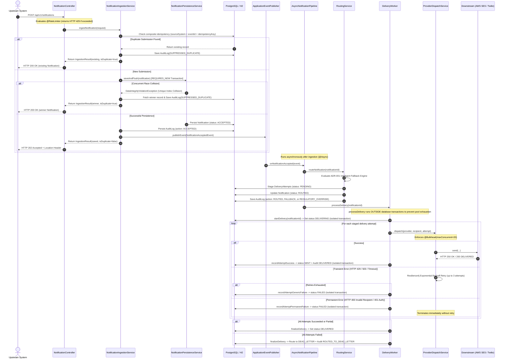
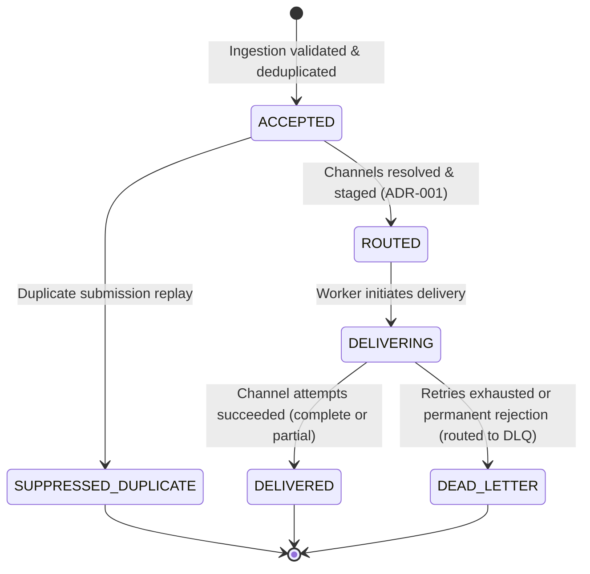

# Architecture Overview: Notification Management Service

Enterprise Notification Management Service prototype built for high-throughput, fault-tolerant alert distribution.

---

## 1. System Components

The service is architected into modular, loosely coupled components following Clean Architecture and Domain-Driven Design (DDD) principles:

```
com.demo.notification
├── api
│   ├── controller
│   │   └── NotificationController.java       # REST endpoints with @RateLimiter & OpenAPI 3.0 annotations
│   ├── dto                                   # Strongly typed Request/Response DTOs with Bean Validation
│   ├── error
│   │   └── GlobalExceptionHandler.java       # Centralized RFC 7807 ProblemDetail exception handler
│   └── filter
│       └── CorrelationIdFilter.java          # Cross-boundary MDC correlation ID tracking
├── channel
│   ├── ChannelProvider.java                  # Strategy interface for delivery channels
│   ├── ChannelProviderRegistry.java          # Provider lookup and channel availability registry
│   ├── EmailChannelProvider.java             # AWS SES email provider with fault simulation
│   ├── SmsChannelProvider.java               # Twilio SMS provider with fault simulation
│   └── DeliveryResponse.java                 # Standardized provider response abstraction
├── delivery
│   ├── AsyncNotificationPipeline.java        # Asynchronous pipeline orchestrator
│   ├── DeliveryWorker.java                   # Worker driving delivery attempts with strictly scoped DB transactions
│   ├── NotificationAcceptedEvent.java        # Domain event fired after ingestion
│   ├── NotificationRoutedEvent.java          # Domain event fired when routing completes
│   └── ProviderDispatchService.java          # Fault-tolerant provider dispatcher with @Bulkhead & @Retry
├── domain
│   ├── model
│   │   ├── Notification.java                 # Aggregate root: lifecycle state, payload, relations
│   │   ├── NotificationRecipient.java        # Recipient address, preferences, quiet hours, opt-outs
│   │   ├── DeliveryAttempt.java              # Channel attempts, provider status, execution time, error codes
│   │   ├── AuditLog.java                     # Tamper-evident, PII-sanitized audit log
│   │   └── IdempotencyRecord.java            # Deduplication key and payload hash
│   ├── repository
│   │   ├── NotificationRepository.java       # Spring Data JPA repository with @EntityGraph queries
│   │   ├── DeliveryAttemptRepository.java
│   │   ├── AuditLogRepository.java
│   │   └── IdempotencyRecordRepository.java
│   └── types
│       ├── NotificationStatus.java           # ACCEPTED, ROUTED, DELIVERING, DELIVERED, DEAD_LETTER, FAILED
│       ├── Severity.java                     # LOW, MEDIUM, HIGH, CRITICAL
│       ├── Priority.java                     # LOW, NORMAL, HIGH, URGENT
│       ├── ChannelType.java                  # EMAIL, SMS, SLACK, IN_APP, WEBHOOK
│       ├── DeliveryStatus.java               # PENDING, SENT, RETRYING, FAILED, CANCELLED
│       ├── ErrorCategory.java                # TRANSIENT, RATE_LIMIT, TIMEOUT, INVALID_RECIPIENT, AUTH_ERROR
│       └── AuditAction.java                  # State transitions including ROUTED_TO_DEAD_LETTER
├── observability
│   ├── NotificationMetrics.java              # Micrometer counters and timers
│   └── NotificationChannelsHealthIndicator.java # Custom Actuator health check at /actuator/health
├── service
│   ├── IngestionResult.java
│   ├── NotificationIngestionService.java     # Deduplication gate, race-condition recovery, event publishing
│   ├── NotificationPersistenceService.java   # Isolated REQUIRES_NEW transactional persistence boundary
│   ├── NotificationQueryService.java         # Aggregated status, channel progress, audit timeline builder
│   ├── RoutingResult.java
│   └── RoutingService.java                   # Channel strategy selection with ADR-001 Intelligent Fallback
└── util
    └── DataMaskingUtils.java                 # PII masking (emails, phones, credentials, card numbers)
```

---

## 2. Technology Stack & Tools

| Layer / Concern | Technology | Version | Rationale |
|---|---|---|---|
| **Language & Runtime** | Java / OpenJDK | Java 21 LTS | Records, pattern matching, virtual-thread readiness |
| **Framework** | Spring Boot | 3.3.4 | Enterprise dependency injection, async execution, Bean validation |
| **Data Persistence** | Spring Data JPA / Hibernate | Hibernate 6.5 | Object-relational mapping, isolated transaction propagation |
| **Databases** | PostgreSQL / H2 | PostgreSQL 16 / H2 2.2 | PostgreSQL for production; embedded H2 (`MODE=PostgreSQL`) for zero-dependency local dev |
| **Migrations** | Flyway | 10.10 | Versioned, reproducible schema migrations (`V1__init_schema.sql`) |
| **Fault Tolerance** | Resilience4j | 2.2.0 | Semaphore Bulkheads, Rate Limiters, bounded exponential retries |
| **Observability** | Micrometer & Spring Actuator | 3.3.4 | Custom metrics, distribution summaries, deep `/actuator/health` checks |
| **API Standards** | RFC 7807 / OpenAPI 3.0 | Spring 6 ProblemDetail | Standardized machine-readable error responses with correlation IDs |
| **Testing & Coverage** | JUnit 5, MockMvc, JaCoCo | JaCoCo 0.8.15 | 107 tests with **98.88% code coverage** enforced at 97% minimum threshold |

---

## 3. Control Flow & Execution Approach

The service adopts an **asynchronous, event-driven pipeline** decoupling the high-throughput ingestion API from downstream provider dispatch:



---

## 4. State Transition Lifecycle Model

The notification entity transitions through an explicit state machine:



---

## 5. Non-Functional Requirements & Enterprise Hardening

1. **Database Transaction Scoping**:
   - Long-running network dispatches to external providers (`AWS SES`, `Twilio`) run **strictly outside database transactions** in [`DeliveryWorker.java`](file:///c:/Users/jainv/.gemini/antigravity/scratch/notification-service/src/main/java/com/demo/notification/delivery/DeliveryWorker.java).
   - Database operations are scoped into fine-grained atomic helper transactions using `Propagation.REQUIRES_NEW`, preventing HikariCP connection pool exhaustion during downstream network latency.
2. **Concurrency Control**:
   - Deduplication is guaranteed at the database engine level via composite unique index `(source_system, event_id, idempotency_key)`.
   - Simultaneous duplicate collisions throw `DataIntegrityViolationException`, which is caught cleanly in [`NotificationIngestionService.java`](file:///c:/Users/jainv/.gemini/antigravity/scratch/notification-service/src/main/java/com/demo/notification/service/NotificationIngestionService.java), resolving to the winner row and returning HTTP 200 OK.
3. **Dead Letter Queue (DLQ) Routing**:
   - Permanently failed or retry-exhausted dispatches transition to `DEAD_LETTER` with `AuditAction.ROUTED_TO_DEAD_LETTER` compliance auditing.
4. **Resilience4j Bulkheads & Rate Limiting**:
   - `@Bulkhead(name = "providerDispatchBulkhead")` prevents outbound provider thread exhaustion.
   - `@RateLimiter(name = "notificationIngestionRateLimiter")` protects inbound ingestion, returning HTTP 429 Too Many Requests.
5. **RFC 7807 Problem Details**:
   - Unified error handling via Spring Boot 3 `ProblemDetail` formatted as `application/problem+json` with distributed tracing `correlationId`.
6. **Observability & Custom Metrics**:
   - Micrometer counters and timers in `NotificationMetrics` (`notifications.received`, `notifications.delivered`, `notifications.failed`, `notifications.deadletter`, `notifications.ratelimited`).
   - Deep health check indicator in `NotificationChannelsHealthIndicator` at `/actuator/health`.
7. **PII Data Sanitization**:
   - `DataMaskingUtils` masks email addresses, phone numbers, query parameters, and card/SSN tokens before audit log persistence.
8. **Enforced Test Coverage**:
   - Enforces a minimum line coverage threshold of **97%** in `pom.xml`, currently achieving **98.88%** line coverage across 107 passing tests.

---

## 6. Production Scaling & Enterprise Architecture Roadmap

For cloud-native deployment handling 50,000+ notifications/sec during market opening volatility, the service is architected to evolve cleanly without changing core domain logic:

| Component | Prototype Architecture | Enterprise Production Target | Architectural Defense |
|---|---|---|---|
| **Event Bus** | Spring In-Memory `@Async` Events | **Transactional Outbox Pattern + Apache Kafka** | Solves dual-write problem. Ensures zero message loss if the pod restarts immediately after returning HTTP 202. |
| **Idempotency** | Relational DB composite unique check | **Distributed Redis Cache (`SETNX` lease with TTL)** | Shields PostgreSQL from handling 20,000 queries/sec solely for idempotency checks during trading surges. |
| **SLA / Queuing** | Single FIFO `ThreadPoolExecutor` | **Priority-Tiered Kafka Topics / Queues** | Prevents high-volume batch statements from starving critical 2FA OTP codes and Margin Call alerts (Head-of-Line blocking). |
| **Audit Storage** | Relational `audit_logs` table | **WORM Store (S3 Glacier Vault Lock / BigQuery)** | Avoids table bloat with billions of rows while strictly complying with SEC Rule 17a-4 / FINRA electronic record retention mandates. |
| **Quiet Hours** | Server local clock | **Recipient IANA Timezone-Aware Evaluation** | Evaluates `ZonedDateTime.now(recipientZoneId)` to ensure strict federal TCPA compliance ($500–$1,500 statutory fines per violation). |
| **Batch Ingestion** | Single-record `POST /api/v1/notifications` | **Batch API `POST /api/v1/notifications/batch`** | Enables upstream clearing engines to submit thousands of trade confirmations in single network calls with JDBC batching. |
