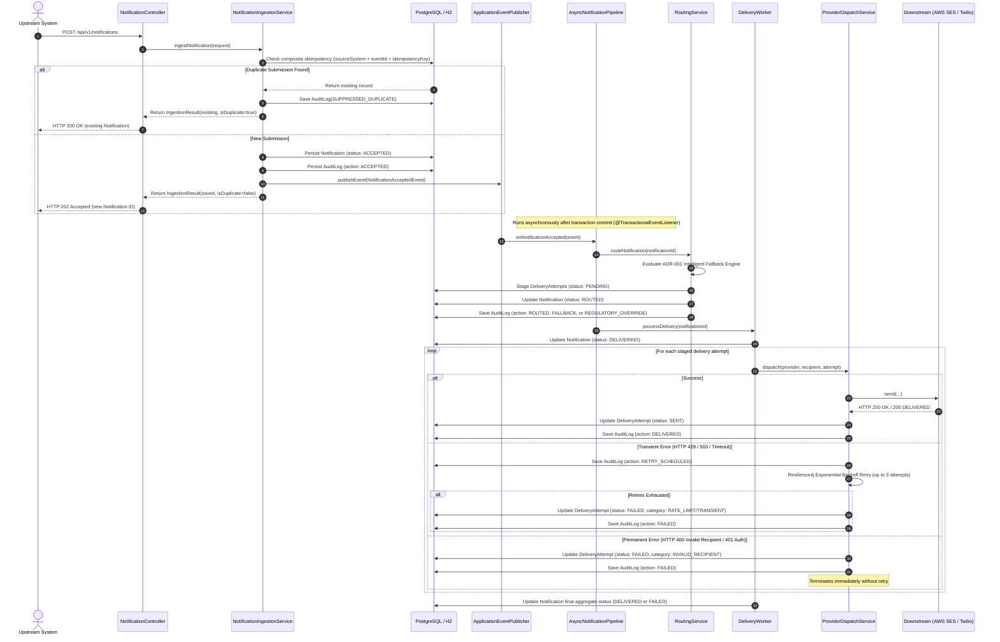
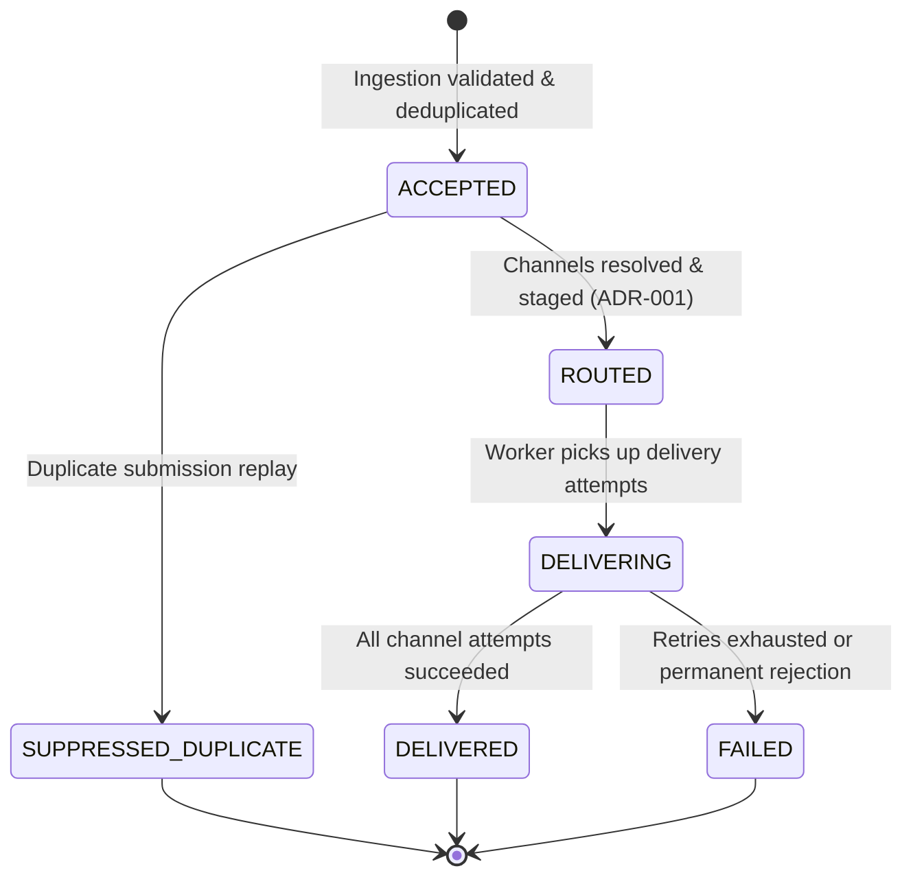

# Architecture Overview: Notification Management Service

Enterprise Notification Management Service prototype built for the **Charles Schwab AI-Assisted Software Engineering Assessment**.

---

## 1. System Components

The service is architected into modular, loosely coupled components following Clean Architecture and Domain-Driven Design (DDD) principles:

```
com.schwab.notification
├── api
│   ├── controller
│   │   └── NotificationController.java       # REST endpoints for submission, status, and on-demand dispatch
│   ├── dto                                   # Strongly typed Request/Response DTOs with Bean Validation
│   └── error
│       ├── ApiErrorResponse.java             # RFC 7807 compliant error structure
│       └── GlobalExceptionHandler.java       # Centralized exception handling
├── channel
│   ├── ChannelProvider.java                  # Strategy interface for delivery channels
│   ├── ChannelProviderRegistry.java          # Provider lookup and channel availability registry
│   ├── EmailChannelProvider.java             # AWS SES email provider with fault simulation
│   ├── SmsChannelProvider.java               # Twilio SMS provider with fault simulation
│   └── DeliveryResponse.java                 # Standardized provider response abstraction
├── delivery
│   ├── AsyncNotificationPipeline.java        # Asynchronous pipeline orchestrator
│   ├── DeliveryWorker.java                   # Worker driving delivery attempts and state transitions
│   ├── NotificationAcceptedEvent.java        # Domain event fired after transaction commit
│   ├── NotificationRoutedEvent.java          # Domain event fired when routing completes
│   └── ProviderDispatchService.java          # Fault-tolerant provider dispatcher with Resilience4j @Retry
├── domain
│   ├── model
│   │   ├── Notification.java                 # Aggregate root: lifecycle state, payload, relations
│   │   ├── NotificationRecipient.java        # Recipient address, preferences, quiet hours, opt-outs
│   │   ├── DeliveryAttempt.java              # Channel attempts, provider status, execution time, error codes
│   │   ├── AuditLog.java                     # Tamper-evident, PII-sanitized audit log
│   │   └── IdempotencyRecord.java            # Deduplication key and payload hash
│   ├── repository
│   │   ├── NotificationRepository.java       # Spring Data JPA repository with custom queries
│   │   ├── DeliveryAttemptRepository.java
│   │   ├── AuditLogRepository.java
│   │   └── IdempotencyRecordRepository.java
│   └── types
│       ├── NotificationStatus.java           # ACCEPTED, ROUTED, DELIVERING, DELIVERED, FAILED, etc.
│       ├── Severity.java                     # LOW, MEDIUM, HIGH, CRITICAL
│       ├── Priority.java                     # LOW, NORMAL, HIGH, URGENT
│       ├── ChannelType.java                  # EMAIL, SMS, SLACK, IN_APP, WEBHOOK
│       ├── DeliveryStatus.java               # PENDING, SENT, RETRYING, FAILED, CANCELLED
│       ├── ErrorCategory.java                # TRANSIENT, RATE_LIMIT, TIMEOUT, INVALID_RECIPIENT, AUTH_ERROR
│       └── AuditAction.java                  # Comprehensive state-transition audit actions
└── service
    ├── IngestionResult.java
    ├── NotificationIngestionService.java     # Ingestion validation, deduplication gate, initial audit
    ├── NotificationQueryService.java         # Aggregated status, channel progress, audit timeline builder
    ├── RoutingResult.java
    └── RoutingService.java                   # Channel strategy selection with ADR-001 Intelligent Fallback
```

---

## 2. Technology Stack & Tools

| Layer / Concern | Technology | Version | Rationale |
|---|---|---|---|
| **Language & Runtime** | Java / OpenJDK | Java 21 LTS (release 21) | Modern Java records, pattern matching, virtual-thread readiness |
| **Framework** | Spring Boot | 3.3.4 | Enterprise dependency injection, async execution, validation |
| **Data Persistence** | Spring Data JPA / Hibernate | Hibernate 6.5 | Object-relational mapping, transactional lifecycle |
| **Databases** | PostgreSQL / H2 | PostgreSQL 16 / H2 2.2 | PostgreSQL for production; in-memory H2 (`MODE=PostgreSQL`) for zero-dependency local dev |
| **Migrations** | Flyway | 10.10 | Versioned, reproducible schema migrations (`V1__init_schema.sql`) |
| **Fault Tolerance** | Resilience4j | 2.2.0 | Bounded exponential retries, backoff multipliers, circuit breaking |
| **Observability** | Spring Boot Actuator | 3.3.4 | Production health checks (`/actuator/health`), JVM metrics |
| **Testing** | JUnit 5, AssertJ, MockMvc, Testcontainers | 5.10 / 1.19 | Comprehensive unit, slice, resilience, and container integration testing |

---

## 3. Control Flow & Execution Approach

The service adopts an **asynchronous, event-driven pipeline** decoupling the high-throughput ingestion API from downstream provider dispatch:



---

## 4. State Transition Lifecycle Model

The notification entity transitions through an immutable state machine:



---

## 5. Key Decisions and Design Patterns

1. **Strategy Pattern (`ChannelProvider` & `ChannelProviderRegistry`)**:
   - Isolates channel-specific protocols (SMTP, SMS SMPP/HTTP, Webhooks) behind a uniform contract. Adding a new channel (e.g. Slack or Push) requires zero changes to routing or delivery orchestrators.
2. **Hierarchical Intelligent Fallback Engine (ADR-001)**:
   - Resolves ambiguous conflicts between source system demands, quiet hours, user opt-outs, and regulatory duty-of-care (FINRA Rule 4210 / SEC rules).
3. **Resilience4j Bounded Exponential Backoff**:
   - Prevents cascading provider outages and downstream rate-limit hammering via exponential backoff (`multiplier=2`) and strict retry budgets (`max-attempts=3`).
4. **Tamper-Evident, PII-Sanitized Audit Trail**:
   - Every state transition, routing diversion, retry, and delivery status change writes an immutable `AuditLog` row. Sanitization ensures credentials, API keys, passwords, and raw payloads are never persisted.
5. **Zero-Friction Development Profile**:
   - Default active profile `dev` operates with in-memory H2 in PostgreSQL compatibility mode, enabling instant evaluation without requiring external infrastructure.

